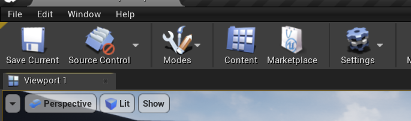
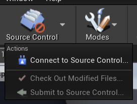
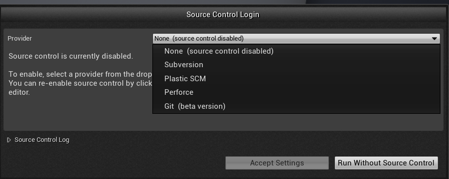
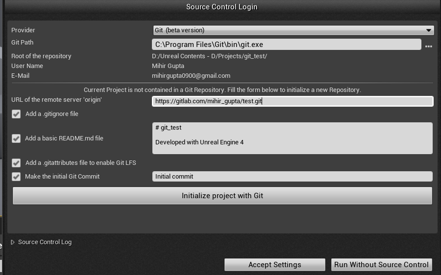
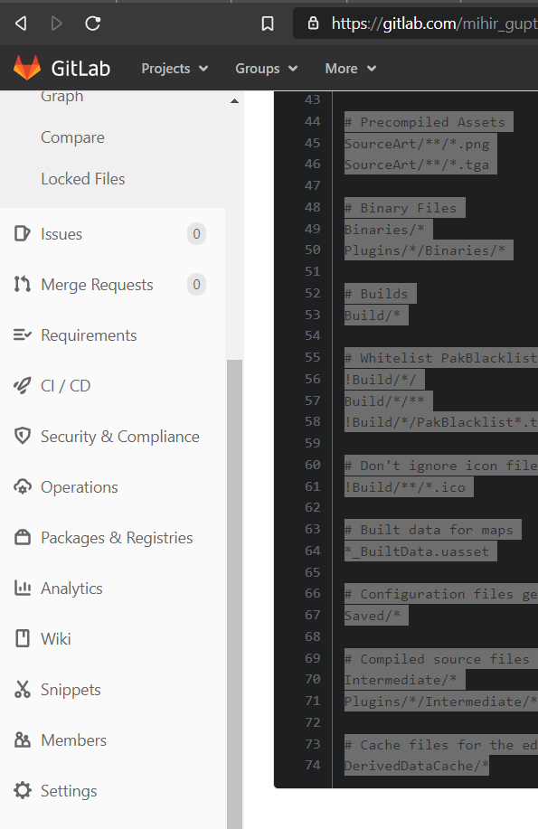
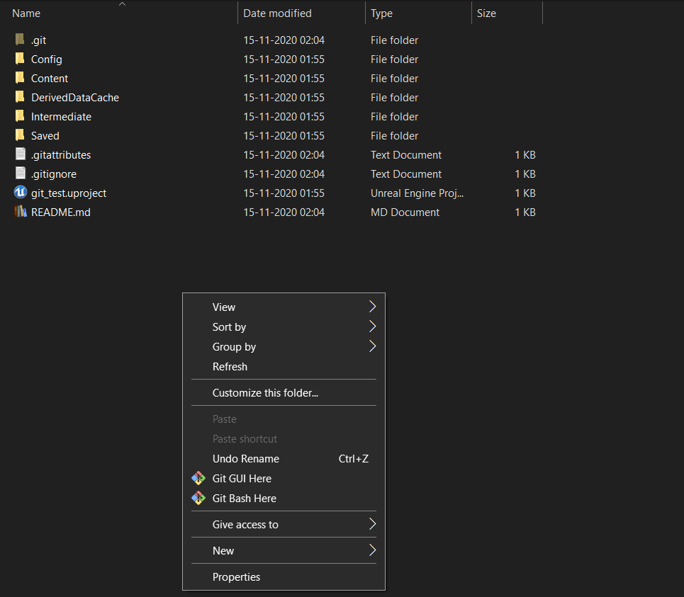
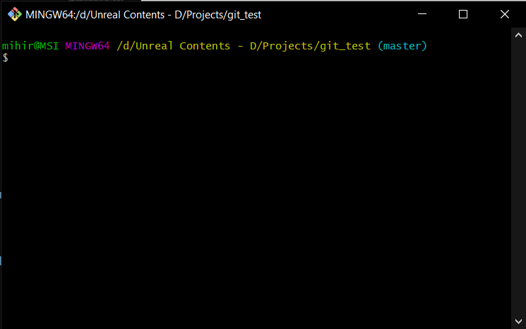

## Installation

1. Install [git](https://git-scm.com/downloads) and [git lfs](https://git-lfs.github.com/)
2. Make an account with [Gitlabs](about.gitlab.com)
    - You can skip the free trial, not needed 
    - we are using gitlab instead of github, as it gives 10gb storage per repo
3. Make a new blank project (aka repository in github) in gitlab
4. Click on the Clone button and copy the url with heading as "Clone with HTTPS"
    - Keep this saved, we will need. Btw, you can get this url anytime

## Setting up UE4 project and connecting to source control

1. Make a new project, preferrably without starter content to reduce data, but upto you
    -  Currently source control is not activated
    

2. Press on "Connect to source control" and then choose git from the dropdown



3. If you did default installation of git, then the "Git Path" field will be filled
    - In the URL tab, paste the link of the project I asked you to copy
    - Keep the same settings as I have
    

4. Click on initialize project
    - Now your project is connected to source control!

5. Some important changes 
    - Open the project folder, you will find a file called .gitattributes, replace the contents of that file with the following text
    ```.gitattributes
    Content/** filter=lfs diff=lfs merge=lfs -text
    # UE file types
    *.uasset filter=lfs diff=lfs merge=lfs -text
    *.umap filter=lfs diff=lfs merge=lfs -text

    # Raw Content types
    *.fbx filter=lfs diff=lfs merge=lfs -text
    *.3ds filter=lfs diff=lfs merge=lfs -text
    *.psd filter=lfs diff=lfs merge=lfs -text
    *.png filter=lfs diff=lfs merge=lfs -text
    *.mp3 filter=lfs diff=lfs merge=lfs -text
    *.wav filter=lfs diff=lfs merge=lfs -text
    *.xcf filter=lfs diff=lfs merge=lfs -text
    *.jpg filter=lfs diff=lfs merge=lfs -text
    ```

    - And replace the contents of .gitignore file with
    ```.gitignore
    # Visual Studio 2015 user specific files
    .vs/

    # Compiled Object files
    *.slo
    *.lo
    *.o
    *.obj

    # Precompiled Headers
    *.gch
    *.pch

    # Compiled Dynamic libraries
    *.so
    *.dylib
    *.dll

    # Fortran module files
    *.mod

    # Compiled Static libraries
    *.lai
    *.la
    *.a
    *.lib

    # Executables
    *.exe
    *.out
    *.app
    *.ipa

    # These project files can be generated by the engine
    *.xcodeproj
    *.xcworkspace
    *.sln
    *.suo
    *.opensdf
    *.sdf
    *.VC.db
    *.VC.opendb

    # Precompiled Assets
    SourceArt/**/*.png
    SourceArt/**/*.tga

    # Binary Files
    Binaries/*
    Plugins/*/Binaries/*

    # Builds
    Build/*

    # Whitelist PakBlacklist-<BuildConfiguration>.txt files
    !Build/*/
    Build/*/**
    !Build/*/PakBlacklist*.txt

    # Don't ignore icon files in Build
    !Build/**/*.ico

    # Built data for maps
    *_BuiltData.uasset

    # Configuration files generated by the Editor
    Saved/*

    # Compiled source files for the engine to use
    Intermediate/*
    Plugins/*/Intermediate/*

    # Cache files for the editor to use
    DerivedDataCache/*
    ```

6. Now add your teammates as Members in your project by going to the members section on the left and inviting them as maintainers
    

<hr/>

## Managing the Project

- Me and my team mates use the command line (cmd) as it easier to use than github desktop
- Get ready to feel like a hacker xD

1. Go to your project folder, right click anywhere and click on "Get Git bash here"
    
    

2. Set up global git, only to do it the first time
    ```bash
    git config --global user.name "John Doe"
    git config --global user.email "johndoe@gmail.com"
    ```

3. After you make any changes and you want to upload to the project on the server, enter the below commands

    ```bash
    git add .
    git commit -m "changes that have been made"
    git push origin master
    ```

- There is one more concept called **branches**, which I think will make it a bit complicated for now.
    - Without branches, multiple people cannot work on the same project at the same time. They can send the file to others, but not work simultaneously.

- So for this project, when one person is working on the project, other cannot work on it. They can do other things like finding assets, making materials etc.

<hr/>

## Steps for the person who did not setup the project

1. Clone the project to your desired place
    - Open the git bash in the project you want to put the project in, then run the following command
    ```bash
    git clone urlofproject
    ```
    - Where url of project for me is https://gitlab.com/mihir_gupta/test.git

2. Now you can open your project by double clicking the file name `yourprojectname.uproject`

3. Do whatever work you want to do, then when you finish, write the following commands in gitbash (make sure you are in the root folder (thefolder which has  the .uproject file))
    ```bash
    git add .
    git commit -m "changes that have been made"
    git push origin master
    ```

4. For the other team mates, open git bash in your project and write the following line to get the changes that your teammate has done
    ```bash
    git pull origin master
    ```
5. And then continue your work and then you can upload the chnages using the same steps

**NOTE:** Suppose your team mate Harsh is working on the project, and you aren't supposed to make any changes to the project. But you did it by mistake. It's okay, execute the following command to remove any changes you made after the last pull.
```bash
git reset --hard
```

<hr/>

## Common git commands

1. To add all file
```bash
git add .
```

2. To commit with msg
```bash
git commit -m "the message"
```

3. To push
```bash
git push origin branch_name
```

4. To pull
```bash
git pull origin branch_name
```

- When update with the master, branch_name = master

- To make a new branch
```bash
git checkout -b "branch_name"
```

- To switch branches
```bash
git checkout "branch_name"
```

- To get status 
```bash
git status
```

add => ready to be stages (commited)
commit => local repo => update
push => remote repo update
